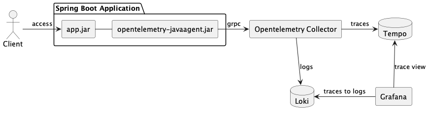
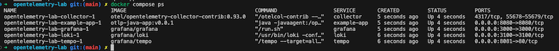

# opentelemetry-lab



## Pre-requisite

You need to build the `Spring Boot project` image first before you use docker-compose to start the service for testing.

1. Test if there are any errors during the startup:

```
mvn spring-boot:run
```

2. Use `curl` command to access the url `http://localhost:8080`, you will see the greeting message if there are no problems on the project codes

```
curl http://localhost:8080

{"message":"Hello, World"}
```

3. Build the java image

```
docker build . -t otlp-java-app:v0.0.1
```

## Startup OpenTelemetry Lab services

1. Run `docker-compose` command

```
docker compose up -d
```

2. Check that all services are work fine

```
docker compose ps
```



3. Next, please go to the [configuration page](./docs/grafana.md) of Grafana to create a datasource.