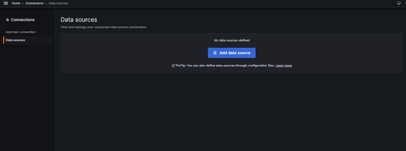
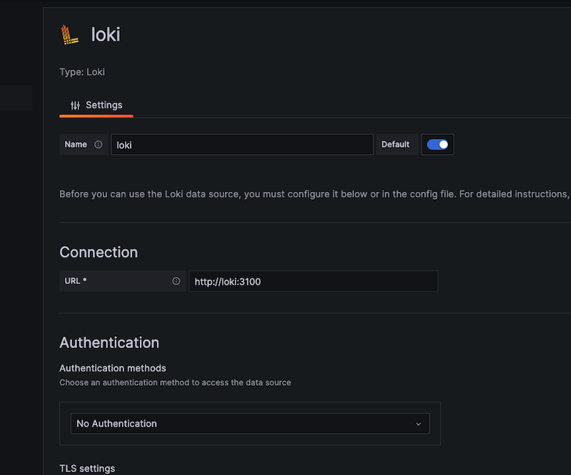
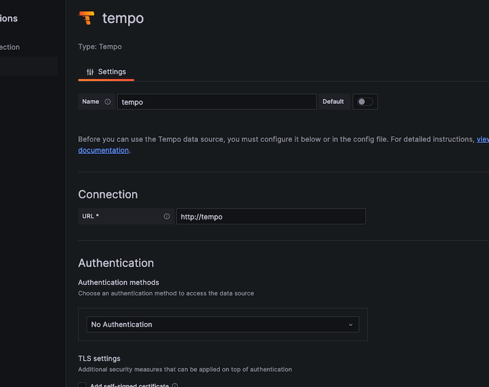
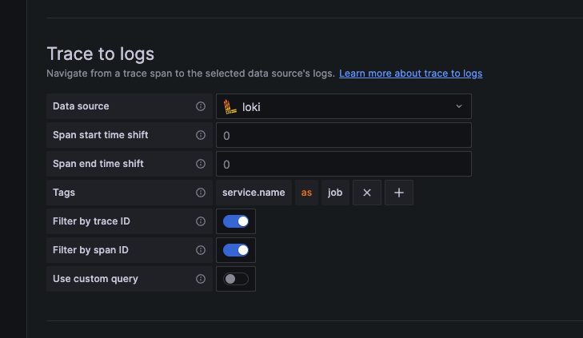
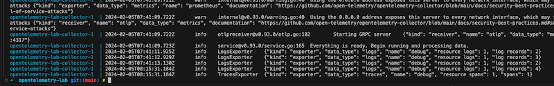
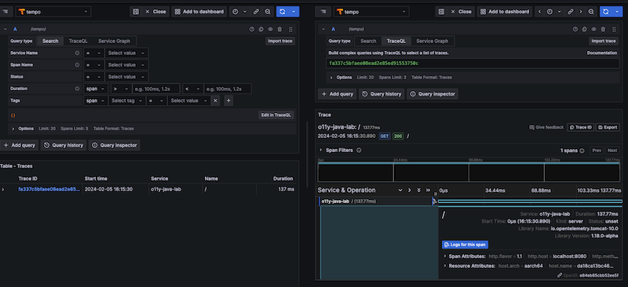
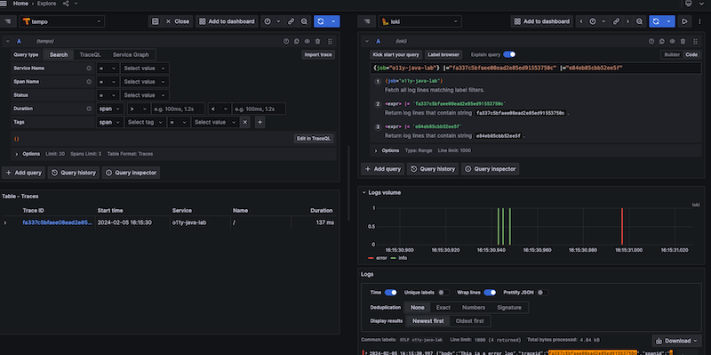

## Grafana Settings

In order to verify that OpenTelemetry is work fine, please follow the steps below to create a datasource on Grafana: 

1. Go to `http://localhost:3000/connections/datasources`

click the botton `Add data source`.



2. Create Loki Datasource

choose `Loki` datasource, go to the configuration page and type `http://loki:3100` in the field `URL`, and then click the button `Save & Test`.



3. Create Tempo Datasource

choose `Tempo` datasource, go to the configuration page and type `http://tempo` in the field `URL`.



go to `Trace to logs` section, select `Loki` as datasource and input the tag like the following, and then open the switch button `Filter by trace ID` and `Filter by span ID`.

```
service.name as job
```




4. Test the API

```
curl http://localhost:8080
```

you can use `docker compose logs` command to view the logs of `OpenTelemetry Collector` component:

```
docker compose logs collector
```



5. Go to `Explore` to view traces data

you can go the the `Explore` page `http://localhost:3000/explore` and see the traces view.

check the traces:



check the logs:

